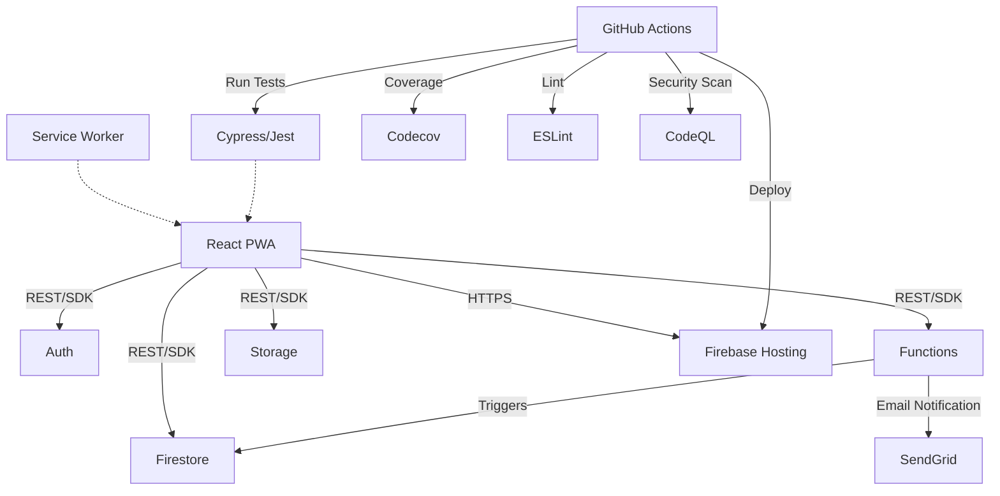

# Voyager PWA

Voyager PWA is a modern, production-grade Progressive Web Application for travel itinerary management.  
It demonstrates advanced software engineering, quality engineering, and DevOps practices using a robust, scalable, and maintainable architecture.

---

## 🏗️ Architecture Diagram



---

## 🚀 Features

- **User Authentication** (Firebase Auth)
- **User Profile Management** (React Context, custom hooks)
- **Itinerary Creation & Management**
- **Responsive UI** (React, Material-UI)
- **Progressive Web App** (Service Worker, offline support)
- **Cloud Backend** (Firebase Firestore, Functions, Storage)
- **End-to-End & Component Testing** (Cypress)
- **Unit Testing** (Jest, React Testing Library)
- **Code Quality & Security** (GitHub CodeQL, ESLint)
- **Automated CI/CD** (GitHub Actions, Firebase Hosting)
- **Code Coverage Reporting** (Codecov)
- **Environment-based Configuration** (dev/prod)
- **Chat & Messaging** (with ChatModal component and real-time Firestore updates)
- **Pull-to-Refresh & Pagination** for chat connections (MUI, custom logic)
- **Email Notifications** for new connections (Firebase Functions + SendGrid)

---

## 🛠️ Tech Stack

- **Frontend:** React 18, TypeScript, Material-UI, React Router
- **State Management:** React Context, React Hooks
- **Backend:** Firebase (Firestore, Auth, Functions, Storage)
- **PWA:** Service Worker, Workbox
- **Testing:**
  - **Unit:** Jest, React Testing Library
  - **Component & E2E:** Cypress (with support for React 18 and MUI)
  - **Coverage:** Codecov
- **Quality & Security:** ESLint, GitHub CodeQL
- **CI/CD:** GitHub Actions, Firebase Hosting
- **Email:** SendGrid (via Firebase Functions and Firestore mail collection)
- **Pull-to-Refresh:** MUI Button (with support for libraries like `react-pull-to-refresh` if desired)
- **Pagination:** Firestore query with `limit` and `startAfter`

---

## ⚙️ Environment Setup

### Prerequisites

- [Node.js](https://nodejs.org/en/download/) (v18+ recommended)
- [npm](https://www.npmjs.com/)
- Firebase CLI (`npm install -g firebase-tools`)

### Installation

```bash
git clone https://github.com/DuaneQ/voyager-pwa.git
cd voyager-pwa
npm install
```

---

## 🔑 Environment Variables

All sensitive credentials (API keys, secrets, etc.) must be stored in environment variables.  
**Do not commit secrets to the repository.**

- Copy `.env.example` to `.env` and fill in the required values.
- For Firebase Functions, use `firebase functions:config:set key=value`.
- For CI/CD, use GitHub Actions secrets.

See `.env.example` for required variables.

---

## 🏁 Working Process

1. Ensure you have NPM (Node Package Manager) installed: [Node.js Download](https://nodejs.org/en/download/)
2. Clone the repo locally:  
   `git clone https://github.com/DuaneQ/voyager-pwa.git`
3. Navigate to the voyager-pwa directory
4. Run `npm install` from the terminal to install all dependencies
5. Create a working branch to begin implementing new features
6. All pull requests require admin approval before merging
7. All newly written code must have accompanying unit tests that are passing in the pipeline
8. Only an admin can merge pull requests

---

## 🚀 Running the App

- To run locally: `npm start`
- To run unit tests: `npm test`

---

## 🧪 Cypress Component & E2E Testing

### Component Testing

- **Component tests are located in:**  
  `cypress/component/`
- **Mock data for component tests is in:**  
  `cypress/mockData/`

#### Running Cypress Component Tests

- To open the Cypress component test runner UI:
  ```bash
  npx cypress open --component
  ```
- To run all component tests headlessly:
  ```bash
  npx cypress run --component
  ```
- To run a specific component test (e.g., ChatModal):
  ```bash
  npx cypress run --component --spec "cypress/component/ChatModal.cy.tsx"
  ```

### E2E Testing

- To run all E2E tests:
  ```bash
  npx cypress run --e2e
  ```

---

## 🗂️ Notable Architecture & Code Structure

- **ChatModal** is now a standalone component in `src/components/modals/ChatModal.tsx` and is tested directly with Cypress component tests.
- **Chat page** (`src/components/pages/Chat.tsx`) consumes `ChatModal` and passes all required props, including `userId`.
- **Component tests** use [@cypress/react](https://docs.cypress.io/guides/component-testing/introduction) and are compatible with React 18 and MUI.
- **Mock data** for component tests is organized in `cypress/mockData/`.
- **Pull-to-refresh and pagination** are implemented for chat connections to optimize Firestore reads and improve UX.
- **Email notifications** for new connections are sent via Firebase Functions and SendGrid integration (see `functions/src/index.ts`).

---

## 📝 Additional Notes

- If you add or update any component, create or update its Cypress component test in `cypress/component/`.
- For new features, ensure you provide both unit and component tests.
- For more details on Cypress component testing, see the [Cypress docs](https://docs.cypress.io/guides/component-testing/introduction).
- **New:**
  - **Pull-to-refresh and pagination** for chat connections.
  - **Email notifications** for new connections (Firebase Functions + SendGrid).
  - **Architectural diagram** (see above).

---

## 🛡️ Security

If you discover a security vulnerability, please see [SECURITY.md](SECURITY.md) for responsible disclosure guidelines.

---

## 🚀 Deployment

To deploy the app to Firebase Hosting:

```bash
firebase deploy --only hosting
```

[](https://codecov.io/gh/DuaneQ/voyager-pwa)
