# AI Itinerary Generation - System Architecture Diagram

```mermaid
graph TB
    %% User Interface Layer
    subgraph "Frontend (React + TypeScript)"
        UI[AIItineraryGenerationModal]
        Hook[useAIGeneration Hook]
        Prefs[useTravelPreferences Hook]
        Progress[Progress Tracking UI]
    end

    %% Authentication & Authorization
    subgraph "Authentication Layer"
        Auth[Firebase Auth]
        Premium[Premium Validation]
        RateLimit[Rate Limiting]
    end

    %% Backend Services
    subgraph "Firebase Functions Backend"
        API[generateItinerary API]
        CostAPI[estimateItineraryCost API]
        StatusAPI[getGenerationStatus API]
    end

    %% Core AI Services
    subgraph "AI Generation Services"
        AIService[AIItineraryService]
        PromptEng[Prompt Engineering]
        Optimizer[Itinerary Optimizer]
    end

    %% External Integrations
    subgraph "External APIs"
        OpenAI[OpenAI GPT-4o-mini]
        GooglePlaces[Google Places API]
        Weather[Weather API]
    end

    %% Data Storage
    subgraph "Firebase Firestore"
        UserPrefs[(User Preferences)]
    Generations[(Itineraries)]
        Analytics[(AI Analytics)]
        UserProfiles[(User Profiles)]
    end

    %% User Flow
    User[Premium User] --> UI
    UI --> Hook
    Hook --> API
    
    %% Authentication Flow
    API --> Auth
    Auth --> Premium
    Premium --> RateLimit
    
    %% AI Generation Process
    RateLimit --> AIService
    AIService --> PromptEng
    PromptEng --> OpenAI
    
    %% Data Collection
    AIService --> GooglePlaces
    AIService --> Weather
    AIService --> UserPrefs
    AIService --> UserProfiles
           Itineraries[(ITINERARIES)]
    %% Processing & Optimization
    OpenAI --> Optimizer
    Optimizer --> AIService
    
    %% Storage & Response
    AIService --> Generations
    AIService --> Analytics
    AIService --> Hook
    Hook --> Progress
    Hook --> UI
    
    %% Cost Estimation Flow
    User --> CostAPI
    CostAPI --> AIService
        ITINERARIES {
    %% Status Checking
    User --> StatusAPI
    StatusAPI --> Generations

    %% Styling
    classDef frontend fill:#e1f5fe
    classDef backend fill:#f3e5f5
    classDef external fill:#fff3e0
    classDef database fill:#e8f5e8
    classDef auth fill:#fce4ec

    class UI,Hook,Prefs,Progress frontend
    class API,CostAPI,StatusAPI,AIService,PromptEng,Optimizer backend
    class OpenAI,GooglePlaces,Weather external
    class UserPrefs,Generations,Analytics,UserProfiles database
    class Auth,Premium,RateLimit auth
```

# AI Generation Process Flow - Detailed Steps

```mermaid
sequenceDiagram
    participant U as User
    participant UI as AI Modal
    participant H as useAIGeneration
    participant A as generateItinerary API
    participant S as AIItineraryService
    participant O as OpenAI API
    participant G as Google Places
    participant DB as Firestore

    %% User Interaction
    U->>UI: Fill trip details & preferences
    UI->>H: generateItinerary(request)
    H->>A: Call Firebase Function
        ITINERARIES ||--o| ITINERARIES : generates
    %% Authentication & Validation
    A->>A: Validate premium user
    A->>A: Check rate limits
    A->>A: Validate request data

    %% Stage 1: Preference Analysis (20%)
    A->>S: Initialize AIItineraryService
    S->>DB: Get user preferences
    S->>DB: Analyze past behavior
    S->>H: Progress: "Analyzing preferences..."
    H->>UI: Update progress bar (20%)

    %% Stage 2: Destination Research (40%)
    S->>G: Get destination info
    S->>G: Find activities & attractions
    S->>G: Get weather forecast
    S->>H: Progress: "Researching destination..."
    H->>UI: Update progress bar (40%)

    %% Stage 3: AI Generation (60%)
    S->>S: Build AI prompt with context
    S->>O: Generate itinerary
    O->>S: Return structured JSON
    S->>H: Progress: "Creating itinerary..."
    H->>UI: Update progress bar (60%)

    %% Stage 4: Optimization (80%)
    S->>S: Optimize timing & routes
    S->>S: Validate logistics
    S->>S: Calculate costs
    S->>H: Progress: "Optimizing itinerary..."
    H->>UI: Update progress bar (80%)

    %% Stage 5: Finalization (100%)
    S->>S: Generate recommendations
    S->>DB: Save generation result
    S->>DB: Update analytics
    S->>H: Progress: "Finalizing..."
    H->>UI: Update progress bar (100%)

    %% Return Results
    S->>A: Return complete response
    A->>H: Success response
    H->>UI: Display generated itinerary
    UI->>U: Show results & actions
```

# Data Flow Architecture

```mermaid
flowchart LR
    %% Input Data Sources
    subgraph "Input Sources"
        TripParams[Trip Parameters]
        UserPrefs[User Preferences]
        PastBehavior[Past Behavior]
    end

    %% Processing Stages
    subgraph "AI Processing Pipeline"
        Stage1[Stage 1: Preference Analysis]
        Stage2[Stage 2: Destination Research]
        Stage3[Stage 3: AI Generation]
        Stage4[Stage 4: Optimization]
        Stage5[Stage 5: Finalization]
    end

    %% External Data
    subgraph "External Data"
        PlacesData[Google Places Data]
        WeatherData[Weather Forecast]
        AIResponse[OpenAI Response]
    end

    %% Output Components
    subgraph "Generated Output"
        Itinerary[Complete Itinerary]
        CostBreakdown[Cost Analysis]
        Recommendations[Recommendations]
        Metadata[Generation Metadata]
    end

    %% Data Flow
    TripParams --> Stage1
    UserPrefs --> Stage1
    PastBehavior --> Stage1
    
    Stage1 --> Stage2
    PlacesData --> Stage2
    WeatherData --> Stage2
    
    Stage2 --> Stage3
    Stage3 --> AIResponse
    AIResponse --> Stage4
    
    Stage4 --> Stage5
    
    Stage5 --> Itinerary
    Stage5 --> CostBreakdown
    Stage5 --> Recommendations
    Stage5 --> Metadata

    %% Styling
    classDef input fill:#e3f2fd
    classDef process fill:#f1f8e9
    classDef external fill:#fff8e1
    classDef output fill:#fce4ec

    class TripParams,UserPrefs,PastBehavior input
    class Stage1,Stage2,Stage3,Stage4,Stage5 process
    class PlacesData,WeatherData,AIResponse external
    class Itinerary,CostBreakdown,Recommendations,Metadata output
```



# Technology Stack Integration


# Database Schema Relationships


# Performance & Cost Optimization


