# AI Itinerary Generation - End-to-End Architecture

## System Overview

```mermaid
graph TB
    subgraph "Frontend (React/TypeScript)"
        UI[AI Generation Modal]
        Hook[useAIGeneration Hook]
        Prefs[useTravelPreferences Hook]
        Progress[Real-time Progress UI]
    end
    
    subgraph "Firebase Authentication"
        Auth[Firebase Auth]
        Premium[Premium Validation]
    end
    
    subgraph "Firebase Functions Backend"
        Generate[generateItinerary Function]
        Validate[User Validation]
        DataFetch[Data Fetching]
        APIs[External API Orchestration]
        AI[AI Generation]
        Storage[Platform Storage]
    end
    
    subgraph "External APIs"
        Amadeus[Amadeus Flight API]
        Places[Google Places API]
        OpenAI[OpenAI GPT-4]
    end
    
    subgraph "Firebase Firestore"
        Users[(users collection)]
        Itineraries[(itineraries collection<br/>ai_status: "completed")]
    end
    
    UI --> Hook
    Hook --> Generate
    Generate --> Auth
    Generate --> Validate
    Validate --> Premium
    Validate --> DataFetch
    DataFetch --> Users
    Generate --> APIs
    APIs --> Amadeus
    APIs --> Places
    APIs --> OpenAI
    Generate --> AI
    AI --> Storage
    Storage --> Itineraries
    Generate --> Progress
    Progress --> UI
```

## Detailed Process Flow

### Phase 1: User Interaction & Validation

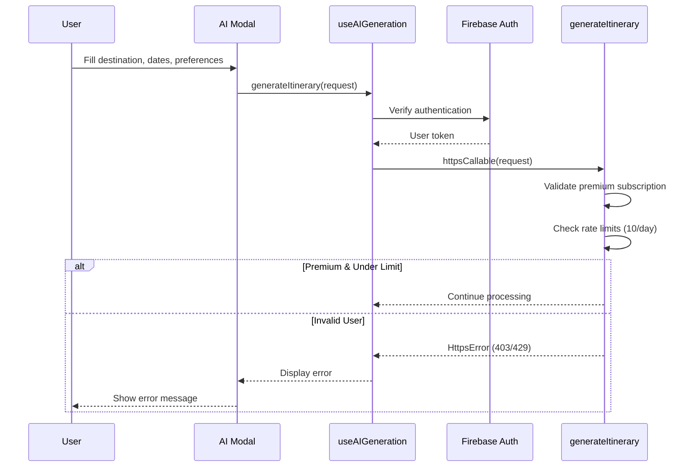

### Phase 2: Data Fetching & External APIs

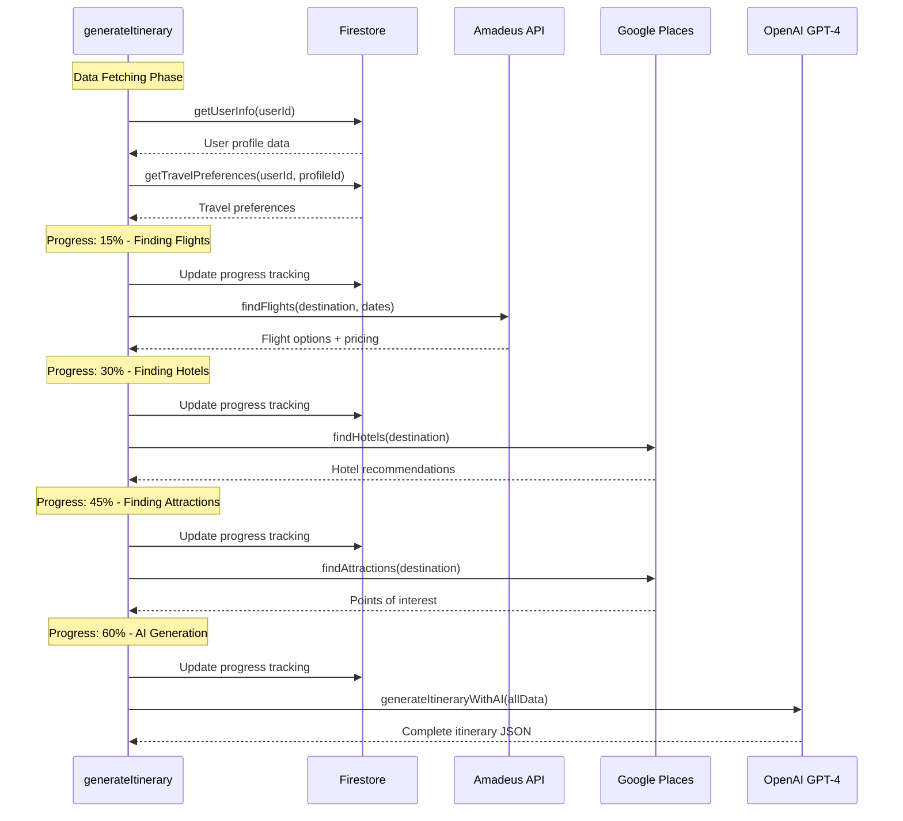

### Phase 3: AI Processing & Storage

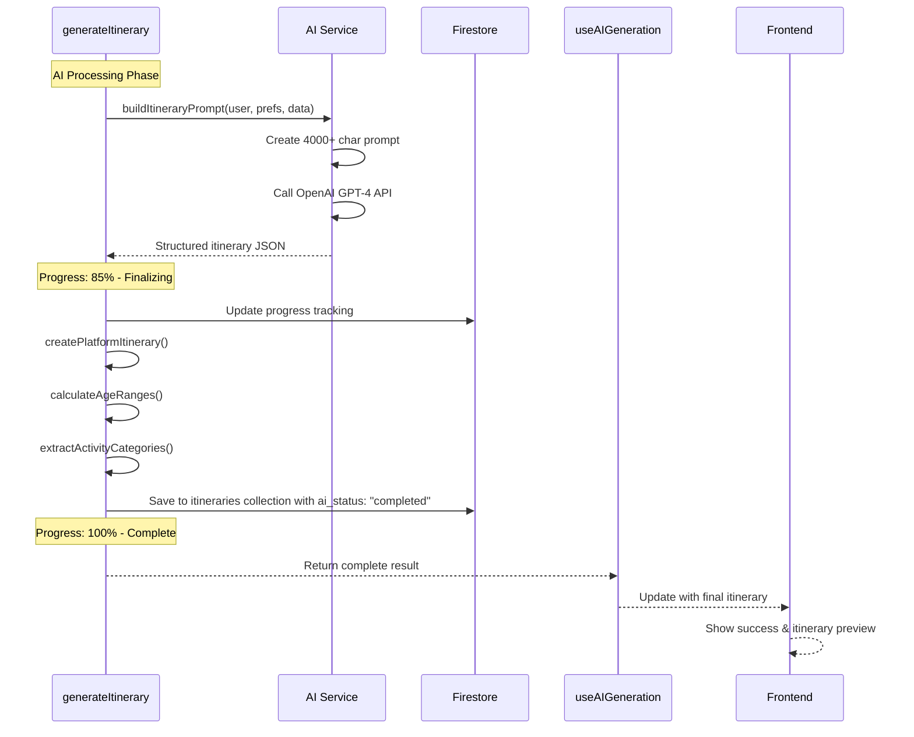

### Phase 4: Real-time Progress Tracking

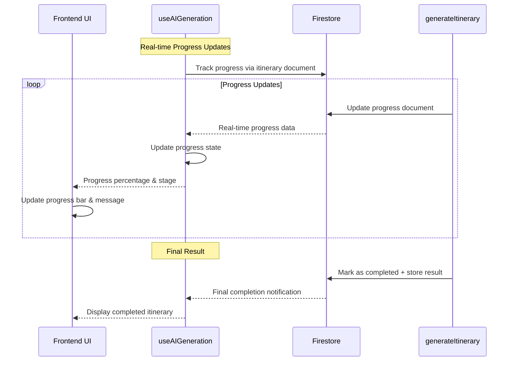

## Data Flow Architecture

### 1. Input Data Structure

```typescript
interface AIGenerationRequest {
  destination: string;           // "Paris, France"
  departure?: string;           // "New York, NY" 
  startDate: string;            // "2025-08-15"
  endDate: string;              // "2025-08-22"
  budget: {
    total: number;              // 2000
    currency: 'USD' | 'EUR' | 'GBP';
  };
  groupSize: number;            // 2
  tripType: 'business' | 'leisure' | 'adventure' | 'romantic' | 'family';
  preferenceProfileId?: string; // "profile_123"
  specialRequests?: string;     // "Include art museums"
  mustInclude?: string[];       // ["Eiffel Tower", "Louvre"]
  mustAvoid?: string[];         // ["Crowded areas"]
}
```

### 2. User Data Integration (Optimized)

**Optimized Data Flow - No Unnecessary Firestore Reads:**

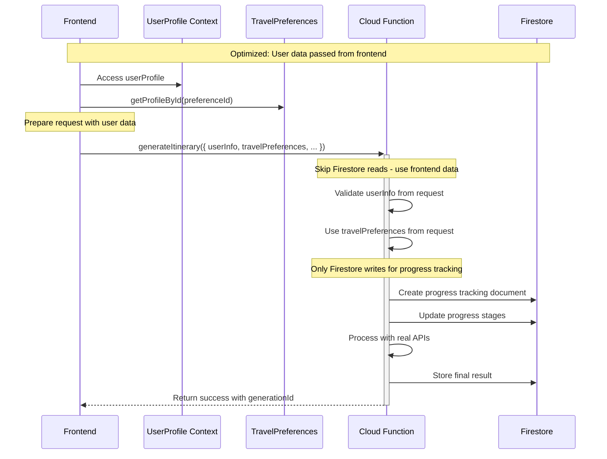

**Key Optimization Benefits:**
- **Eliminates 2 Firestore reads** per generation (getUserInfo + getTravelPreferences)
- **Reduces latency** by ~200-500ms per request  
- **Decreases costs** by avoiding unnecessary read operations
- **Improves reliability** by using data already available in frontend context
- **Maintains fallback support** for legacy requests without user data

```mermaid
graph LR
    subgraph "Frontend Data (Passed to Backend)"
        UserInfo[User Info<br/>• Demographics<br/>• Preferences<br/>• Travel History]
        TravelPrefs[Travel Preferences<br/>• Activity ratings (1-10)<br/>• Budget ranges<br/>• Accommodation type<br/>• Group size preferences]
    end
    
    subgraph "AI Context Building"
        Context[AI Prompt Context<br/>• User demographics<br/>• Preference weights<br/>• Budget constraints<br/>• Trip requirements]
    end
    
    UserInfo --> Context
    TravelPrefs --> Context
    Context --> AI[OpenAI GPT-4]
```

### 3. External API Integration (Parallel Processing)

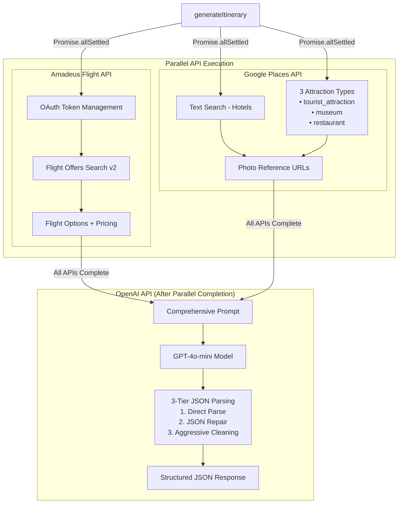

**Performance Note**: APIs execute in parallel (Promise.allSettled) reducing total time from 180+ seconds to ~60-80 seconds.

### 4. AI Prompt Engineering

```mermaid
graph TB
    subgraph "Prompt Components"
        UserContext[User Context<br/>• Age, gender, status<br/>• Travel style<br/>• Budget constraints]
        Preferences[Preferences<br/>• Activity ratings (1-10)<br/>• Food restrictions<br/>• Accommodation type]
        AvailableData[Available Data<br/>• Flight options<br/>• Hotel recommendations<br/>• Attraction listings]
        Requirements[Trip Requirements<br/>• Dates & duration<br/>• Must include/avoid<br/>• Special requests]
    end
    
    subgraph "AI Processing"
        PromptBuilder[buildItineraryPrompt()]
        OpenAI[OpenAI GPT-4<br/>4000 token limit<br/>Temperature: 0.7]
        JSONParser[JSON Response Parser]
    end
    
    UserContext --> PromptBuilder
    Preferences --> PromptBuilder
    AvailableData --> PromptBuilder
    Requirements --> PromptBuilder
    PromptBuilder --> OpenAI
    OpenAI --> JSONParser
```

### 5. Platform Integration

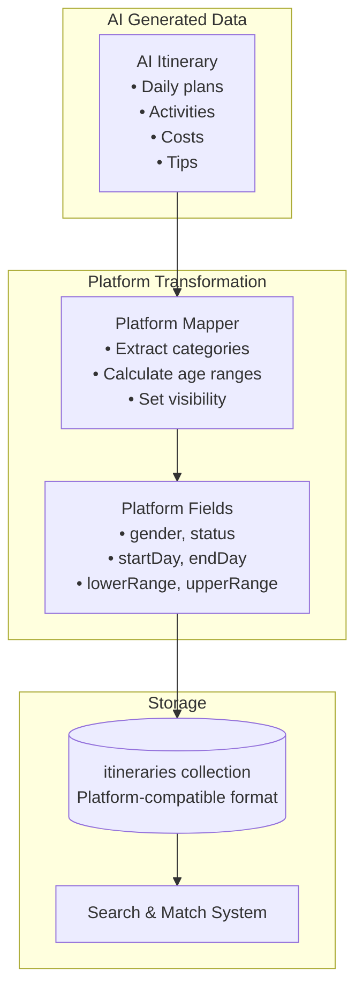

## Error Handling & Resilience

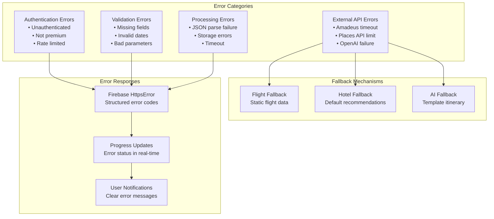

## Performance & Scalability

### Processing Timeline

```mermaid
gantt
    title AI Itinerary Generation Timeline
    dateFormat X
    axisFormat %Ss
    
    section Validation
    Auth Check           :0, 1s
    Premium Check        :0, 1s
    Rate Limit Check     :0, 1s
    
    section Data Fetching
    User Info           :1s, 2s
    Travel Preferences  :1s, 2s
    
    section External APIs
    Flight Search       :2s, 6s
    Hotel Search        :6s, 8s
    Attraction Search   :8s, 10s
    
    section AI Generation
    Prompt Building     :10s, 12s
    OpenAI Processing   :12s, 60s
    JSON Parsing        :60s, 61s
    
    section Storage
    Platform Mapping    :61s, 62s
    Firestore Save      :62s, 63s
    Progress Complete   :63s, 64s
```

### Resource Allocation

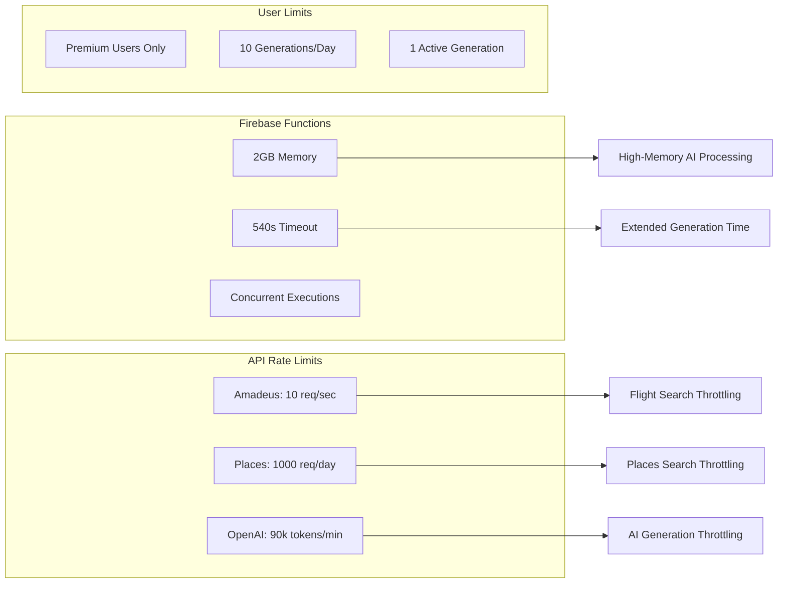

## Security & Privacy

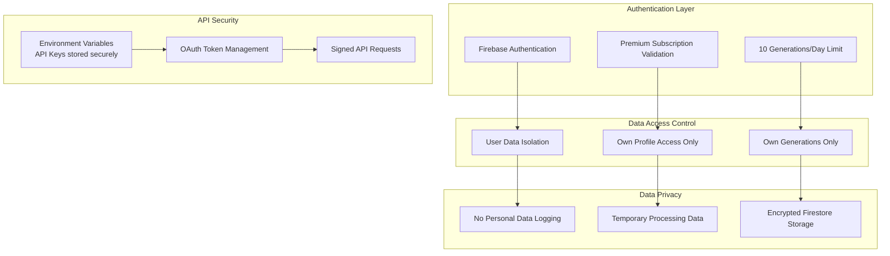

## Monitoring & Observability

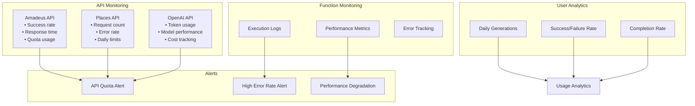

## Summary

This architecture provides:

- ✅ **Single Function Orchestration** - One callable function handles entire process
- ✅ **Real-time Progress Tracking** - Live updates via Firestore listeners  
- ✅ **Comprehensive API Integration** - Amadeus flights, Google Places, OpenAI GPT-4
- ✅ **Platform Compatibility** - Generated itineraries work with existing search/match
- ✅ **Robust Error Handling** - Fallbacks and proper error responses
- ✅ **Performance Optimization** - Minimal Firestore reads, efficient processing
- ✅ **Security & Privacy** - Premium validation, rate limiting, data isolation
- ✅ **Monitoring & Observability** - Complete logging and analytics

The end-to-end flow takes 35-65 seconds typically, with real-time progress updates keeping users engaged throughout the AI generation process.
