# AI Service Architecture Documentation

## Overview

This document outlines the complete service architecture for AI itinerary generation in the Voyager PWA application. The system is designed with robust error handling, fallback mechanisms, and comprehensive logging to ensure reliable AI-powered travel planning.

## Service Flow Diagram

```mermaid
graph TD
    %% Frontend Layer
    A[👤 User fills AI Generation Form] --> B[📱 Frontend: AIItineraryGenerationModal]
    B --> C[🔌 Frontend: useAIGeneration Hook]
    C --> D[☁️ Firebase Function: generateItinerary]

    %% API Gateway Layer
    D --> E[🔐 validatePremiumUser]
    D --> F[✅ validateGenerationRequest]
    D --> G[⏱️ checkRateLimit]
    
    %% Core Service Layer
    G --> H[🤖 AIItineraryService.generateItinerary]
    
    %% Service Dependencies
    H --> I[🔥 Firestore: initializeGeneration]
    H --> J[👤 getUserPreferences]
    H --> K[📊 analyzePastBehavior]
    H --> L[🗺️ GooglePlacesService.getDestinationInfo]
    H --> M[🎯 GooglePlacesService.findActivities]
    H --> N[🌤️ GooglePlacesService.getWeatherForecast]
    H --> O[📝 PromptEngineering.buildItineraryPrompt]
    H --> P[🧠 OpenAIClient.generateItinerary]
    H --> Q[⚡ optimizeItinerary]
    H --> R[💰 calculateCosts]
    H --> S[🎯 generateRecommendations]
    H --> T[💾 saveGeneration]

    %% External API Services
    S --> U[✈️ ExternalApiService.getFlightPrices]
    S --> V[🏨 ExternalApiService.getHotelRecommendations]
    S --> W[📍 ExternalApiService.getDestinationPricing]
    
    %% External APIs (with fallbacks)
    U --> X[🌐 Amadeus Flight API]
    V --> Y[🌐 Hotel Booking APIs]
    W --> Z[🌐 Teleport Cost API]
    
    %% Fallback Data
    X -.->|Timeout/Error| AA[📋 Mock Flight Data]
    Y -.->|Timeout/Error| BB[📋 Mock Hotel Data]
    Z -.->|Timeout/Error| CC[📋 Fallback Cost Data]
    
    %% Database Operations
    I --> DD[(🔥 Firestore: ai_generations)]
    J --> EE[(🔥 Firestore: user_preferences)]
    K --> FF[(🔥 Firestore: itineraries)]
    T --> DD
    T --> GG[(🔥 Firestore: ai_analytics)]

    %% AI Integration
    P --> HH[🌐 OpenAI GPT-4o-mini API]
    
    %% Response Flow
    T --> II[📤 AIGenerationResponse]
    II --> JJ[📱 Frontend: Display Results]

    %% Styling
    classDef frontend fill:#e1f5fe,stroke:#01579b,stroke-width:2px
    classDef api fill:#f3e5f5,stroke:#4a148c,stroke-width:2px
    classDef service fill:#e8f5e8,stroke:#1b5e20,stroke-width:2px
    classDef external fill:#fff3e0,stroke:#e65100,stroke-width:2px
    classDef database fill:#fce4ec,stroke:#880e4f,stroke-width:2px
    classDef fallback fill:#f1f8e9,stroke:#33691e,stroke-width:2px,stroke-dasharray: 5 5

    class A,B,C,JJ frontend
    class D,E,F,G api
    class H,I,J,K,L,M,N,O,P,Q,R,S,T service
    class U,V,W,X,Y,Z,HH external
    class DD,EE,FF,GG database
    class AA,BB,CC fallback
```



## Detailed Service Breakdown

### 1. Frontend Layer

#### `AIItineraryGenerationModal`
- **Purpose**: User interface for AI itinerary generation
- **Key Features**:
  - Flying From (departure city) field
  - Destination selection with Google Places Autocomplete
  - Date selection and trip type configuration
  - Travel preference profile selection
  - Must include/avoid items management
  - Real-time cost estimation

#### `useAIGeneration` Hook
- **Purpose**: State management and API integration
- **Responsibilities**:
  - Form data validation
  - API request handling
  - Progress tracking and error management
  - Real-time cost estimation

### 2. API Gateway Layer

#### `generateItinerary` Firebase Function
- **Timeout**: 540 seconds (9 minutes)
- **Memory**: 2GB for AI processing
- **Security Features**:
  - Premium user validation
  - Request payload validation
  - Rate limiting protection

#### Middleware Services
- **`validatePremiumUser`**: Ensures user has premium subscription
- **`validateGenerationRequest`**: Validates form data integrity
- **`checkRateLimit`**: Prevents API abuse with configurable limits

### 3. Core AI Service Layer

#### `AIItineraryService` - Main Orchestrator

**Stage 1: Setup & User Analysis (20%)**
```typescript
// Initialize generation record
await this.initializeGeneration(request);

// Load user preferences
const userPreferences = await this.getUserPreferences(request.preferenceProfileId);

// Analyze past behavior
const behaviorAnalysis = await this.analyzePastBehavior();
```

**Stage 2: Destination Research (40%)**
```typescript
// Gather destination information
const destinationInfo = await this.placesService.getDestinationInfo(request.destination);
const activities = await this.placesService.findActivities(request.destination, userPreferences);
const weather = await this.placesService.getWeatherForecast(request.destination, request.startDate, request.endDate);
```

**Stage 3: AI Generation (60%)**
```typescript
// Build optimized prompt
const aiPrompt = this.promptService.buildItineraryPrompt({
  request,
  userPreferences,
  behaviorAnalysis,
  destinationInfo,
  activities,
  weather
});

// Generate with OpenAI
const aiResponse = await this.openaiClient.generateItinerary(aiPrompt);
const parsedItinerary = this.parseAIResponse(aiResponse);

// Add departure location if provided
if (request.departure) {
  parsedItinerary.departure = request.departure;
}
```

**Stage 4: Optimization (80%)**
```typescript
// Optimize timing and logistics
const optimizedItinerary = await this.optimizeItinerary(parsedItinerary, request);

// Calculate detailed costs
const costBreakdown = await this.calculateCosts(optimizedItinerary);

// Generate recommendations (flights, hotels, alternatives)
const recommendations = await this.generateRecommendations(optimizedItinerary, activities);
```

**Stage 5: Finalization (100%)**
```typescript
// Save complete results
await this.saveGeneration(request, response, 'completed', processingTime);

// Update analytics
await this.updateAnalytics(successful, processingTime);
```

### 4. External API Integration

#### `ExternalApiService` - Robust API Management

**Flight Pricing Integration**
```typescript
static async getFlightPrices(
  departure: string, 
  destination: string, 
  departureDate: string
): Promise<any[]> {
  try {
    // Amadeus API integration (with fallback)
    const token = await this.getAmadeusToken();
    const response = await this.fetchWithTimeout(
      'https://api.amadeus.com/v2/shopping/flight-offers',
      { /* request options */ },
      this.FLIGHT_API_TIMEOUT
    );
    return this.parseFlightData(await response.json());
  } catch (error) {
    // Graceful fallback to mock data
    return this.getMockFlightData(departure, destination, departureDate);
  }
}
```

**Mock Flight Data Structure**
```typescript
{
  id: 'mock-flight-1',
  airline: 'Major Airline',
  price: { amount: 450, currency: 'USD' },
  departure: { airport: departure, time: '08:00' },
  arrival: { airport: destination, time: '14:30' },
  duration: '6h 30m',
  stops: 0
}
```

**Timeout Management**
```typescript
private static async fetchWithTimeout(
  url: string, 
  options: RequestInit = {}, 
  timeout: number = this.DEFAULT_TIMEOUT
): Promise<Response> {
  const controller = new AbortController();
  const timeoutId = setTimeout(() => controller.abort(), timeout);
  
  try {
    const response = await fetch(url, {
      ...options,
      signal: controller.signal,
    });
    clearTimeout(timeoutId);
    return response;
  } catch (error) {
    clearTimeout(timeoutId);
    if (error instanceof Error && error.name === 'AbortError') {
      throw new Error(`Request timeout after ${timeout}ms`);
    }
    throw error;
  }
}
```

### 5. Database Operations

#### Firestore Collections

**`ai_generations`**
```typescript
{
  id: string;
  userId: string;
  status: 'processing' | 'completed' | 'failed';
  request: AIGenerationRequest;
  response?: AIGenerationResponse;
  processingTimeMs: number;
  createdAt: Timestamp;
  updatedAt: Timestamp;
  errorDetails?: {
    message: string;
    stack?: string;
  };
}
```

**`user_preferences`**
```typescript
{
  userId: string;
  profiles: TravelPreferenceProfile[];
  createdAt: Timestamp;
  updatedAt: Timestamp;
}
```

**`ai_analytics`**
```typescript
{
  date: string; // YYYY-MM-DD
  totalGenerations: number;
  successfulGenerations: number;
  failedGenerations: number;
  averageProcessingTime: number;
  popularDestinations: string[];
  commonFailureReasons: string[];
}
```

### 6. Error Handling & Resilience

#### Timeout Configuration
- **Default API Timeout**: 8 seconds
- **Flight API Timeout**: 10 seconds
- **Teleport API Timeout**: 6 seconds
- **Token Request Timeout**: 5 seconds

#### Fallback Strategies
1. **Flight Data**: Mock flight options with realistic pricing
2. **Hotel Data**: Template hotel recommendations
3. **Cost Data**: Fallback pricing based on destination categories
4. **Weather Data**: Seasonal averages when API fails

#### Error Recovery Flow
```typescript
try {
  // Attempt primary API call
  return await primaryApiCall();
} catch (error) {
  console.warn('⚠️ Primary API failed, using fallback:', error);
  
  // Graceful degradation to mock data
  return getFallbackData();
}
```

## Key Features

### 🔒 **Security & Access Control**
- Premium subscription validation
- Rate limiting (configurable per user tier)
- Request payload validation
- Secure API key management

### 🚀 **Performance Optimization**
- Parallel service calls where possible
- Optimized timeout configurations
- Memory-efficient data processing
- Background analytics tracking

### 🛡️ **Reliability & Resilience**
- Comprehensive error handling
- Graceful API fallbacks
- Mock data generation
- Detailed logging and monitoring

### 📊 **Monitoring & Analytics**
- Generation success/failure tracking
- Processing time analytics
- Popular destination insights
- Common failure reason analysis

### 🔄 **Scalability Design**
- Stateless service architecture
- Firebase Functions auto-scaling
- Efficient database indexing
- Modular service separation

## Development Notes

### Current API Status
- **OpenAI GPT-4o-mini**: ✅ Fully functional
- **Google Places API**: ✅ Fully functional
- **Amadeus Flight API**: ⚠️ Authentication issues (using mock data)
- **Teleport Cost API**: ⚠️ Network resolution issues (using fallbacks)

### Future Enhancements
1. **Real-time Flight Integration**: Fix Amadeus API authentication
2. **Hotel Booking Integration**: Add real hotel booking APIs
3. **Multi-language Support**: Extend AI prompts for international users
4. **Advanced Personalization**: Machine learning-based preference evolution
5. **Collaborative Planning**: Multi-user itinerary planning features

## Testing Strategy

### Unit Tests
- Service layer logic validation
- Mock data generation accuracy
- Error handling completeness

### Integration Tests  
- End-to-end generation flow
- API timeout and fallback behavior
- Database operation integrity

### Performance Tests
- Generation time optimization
- Memory usage profiling
- Concurrent user load testing

## Deployment Configuration

### Firebase Functions
```javascript
export const generateItinerary = functions
  .runWith({
    timeoutSeconds: 540, // 9 minutes
    memory: '2GB'
  })
  .https.onCall(async (data, context) => {
    // Implementation
  });
```

### Environment Variables
```bash
# Required
OPENAI_API_KEY=sk-...
GOOGLE_PLACES_API_KEY=AIza...

# Optional (with fallbacks)
AMADEUS_API_KEY=...
AMADEUS_API_SECRET=...
```

## Troubleshooting Guide

### Common Issues

**1. Generation Timeout**
- Check external API response times
- Review processing stage logs
- Verify memory allocation

**2. Authentication Errors**
- Validate API key configuration
- Check token expiration handling
- Review rate limiting settings

**3. Mock Data Fallbacks**
- External API service disruptions
- Network connectivity issues
- Authentication configuration problems

### Debugging Tools
- Firebase Functions logs
- Firestore query monitoring
- Real-time error tracking
- Performance profiling dashboards

---

*Last Updated: July 25, 2025*
*Version: 1.0.0*
*Maintained by: AI Development Team*
